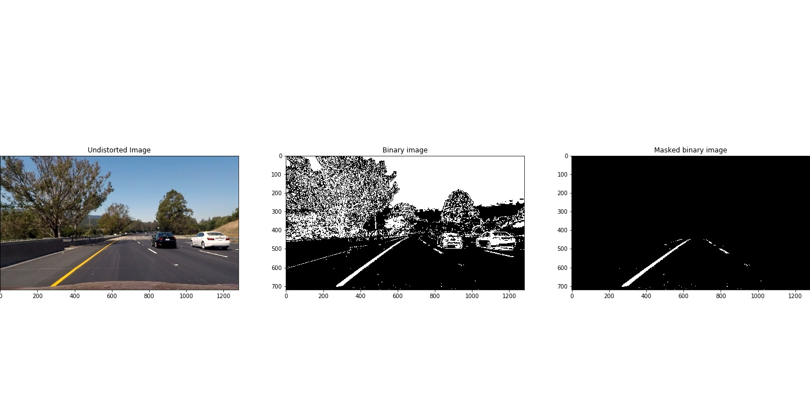

## Writeup 

**Advanced Lane Finding Project**

The goals / steps of this project are the following:

* Compute the camera calibration matrix and distortion coefficients given a set of chessboard images.
* Apply a distortion correction to raw images.
* Use color transforms, gradients, etc., to create a thresholded binary image.
* Apply a perspective transform to rectify binary image ("birds-eye view").
* Detect lane pixels and fit to find the lane boundary.
* Determine the curvature of the lane and vehicle position with respect to center.
* Warp the detected lane boundaries back onto the original image.
* Output visual display of the lane boundaries and numerical estimation of lane curvature and vehicle position.

### Here I will consider the rubric points individually and describe how I addressed each point in my implementation.  

Here is a link to the project rubric: [Rubric](https://review.udacity.com/#!/rubrics/571/view) 

### Camera Calibration

#### 1. Computing the camera matrix and distortion coefficients

The code for this step is contained in the 2nd and 3rd code cell of the IPython notebook located in "./P2.ipynb"

In the function `search_corners()` I start by preparing "object points", which will be the (x, y, z) coordinates of the chessboard corners in the world. Here I am assuming the chessboard is fixed on the (x, y) plane at z=0, such that the object points are the same for each calibration image.  Thus, `objp` is just a replicated array of coordinates, and `objpoints` will be appended with a copy of it every time I successfully detect all chessboard corners in a test image.  `imgpoints` will be appended with the (x, y) pixel position of each of the corners in the image plane with each successful chessboard detection.  

In the function `calc_undistort()` I then use the `objpoints` and `imgpoints` to compute the camera calibration and distortion coefficients using the `cv2.calibrateCamera()` function.  I applied this distortion correction to the test image using the `cv2.undistort()` function and obtained this result: 

### Pipeline (single images)

The pipeline code is contained in the 9th (initialization) and 10th code cell (pipeline)of the IPython notebook located in `/P2.ipynb`

#### 1. Generating distortion-corrected image

To demonstrate this step, I will describe how I apply the distortion correction to one of the test images like this one:

All function used for this step or contained in the 2nd code cell. In order to generate an undistorted image I call the function `calc_undistort()`. Input arguments are the outputs of the camera calibration (`objpoints` and `imgpoints`) and the shape of the  distorted image. To remove the distortion off an image the function `undist_img()` is called in the pipeline. This function takes the original image and the distortion coefficients as input and returns the undistorted image.

#### 2. Creating a thresholded binary image

I used a combination of color and gradient thresholds to generate a binary image. All function used for this step or contained in the 4th code cell. 

The function that converts the image into a binary image (`convert_to_bin()`) consits of 5 steps:

* Step 1: Converting the original RGB image into HLS image
* Step 2: Separating the S-channel
* Step 3: Converting the original RGB image into grayscale image
* Step 4: Use the function `cv2.Sobel()` to calculate the derivative in x 
* Step 5: Applying a threshold to the S-channel image and the derivative in x 

#### 3. Performing a perspective transform

The code for my perspective transform includes a function called `convert_to_birdview()`, which appears in the 5th code cell.  The `convert_to_birdview()` function takes an image (`img`) as inputs, as well as source (`src`) and destination (`dst`) points.  I chose to hardcode the source and destination points. The points are defined in the pipeline itself (code cell 10). 

#### 4. Identifying lane-line pixels and fit their positions with a polynomial

All function used for this step are contained in the 6th code cell. In order to detect the pixels on the image that belong to the left and right lane line I use the sliding window method in the function `find_lane_pixels()`, where the whole image gets scanned.

All detected lane-line-pixels and all other relevant information for of the detected lane line are stored in the objects 'laneLeft' and 'laneRight' (both objects are instances of the class'Line()') using the function `save_lane_data()`. 

After the lane pixels are detected and stored, a 2nd order polynomial is fitted using the function `fit_polynomial()`. 

In order to speed up the detection of lane-line-pixels, a function called `search_around_poly()` has been developed. This function is called after a few successful detections and after a polynomial has been fitted. The function `search_around_poly` only searches for lane-line-pixels around the fitted polynomial from the previous frame(reducing search area).

In order to smooth out the lane detection process, the x-values of the detected lane-lane-pixels are averaged over a specific number of frames in the function `save_lane_data()`.

#### 5. Calculating the radius of curvature of the lane and the position of the vehicle with respect to center.

The functions to calculate the radius of curvature of the lane and the position of the vehicle with respect to center are contained in the 7th code cell.

The radius of curvature is calculated in the function'measure_curvature_pixels' and 'measure_curvature_real' using the following equation: 

with

* A: 2nd order coefficient of lane-line-polynomial 
* B: 1st order coefficient of lane-line-polynomial 
* C: Constant of lane-line-polyinomial 

The position of the vehicle with respect to center is calculated in the function `measure_displacement_from_center` by first averaging the x-values of the detected lane lines at the bottom of the image (= center of lane line) and then calculating the difference between the center of the picture and the center of the lane lines. (It is assumed that the camera is positioned exactly in the middle of the car)

The Radius and position of the vehicle with respect to center are displayed in the upper left corner of the result-image

#### 6. Result image

By running the whole pipeline (function 'advanced_lane_line_finding()'in code cell 10) with the original image as an input, the following result image is obtained:

---

### Testing

To test the pipeline I used a test video. Here's a [link to my video result](./test_videos_output/project_video.mp4)

---

### Discussion

As shown above, the pipeline works well for the test video. But there is still room for improvement:

* First off, the perspective transformation is fairly specific to the camera (which also needs to individually be undistorted prior to the transformation), the mounting of that camera, and even the tilt of the road the car is on.
* Secondly, the various gradient and color thresholds only work in a small set of conditions — all those issues that I mentioned at the outset that computers have in seeing lane lines become very apparent here. 
* Lastly, this technique is slow — the pipeline doesn't match real-time requirements
